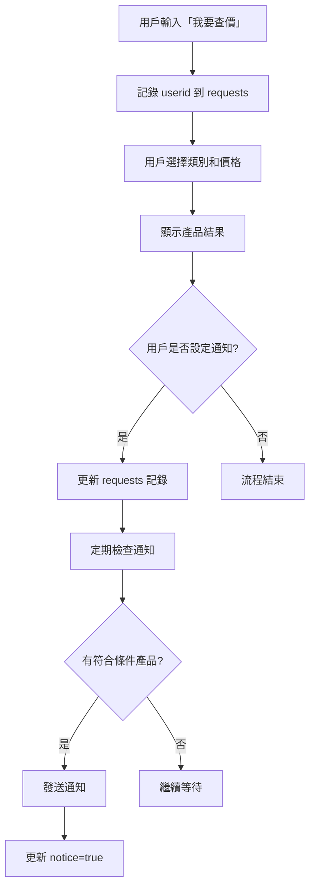
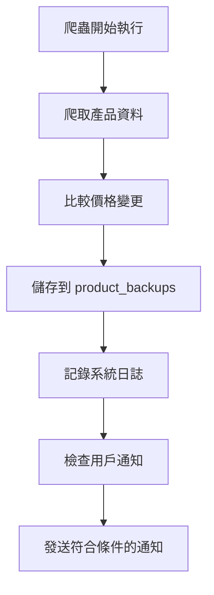

# 🔥 Firebase 資料庫結構說明

## 📊 資料庫概述

本專案使用 Firebase Firestore 作為 NoSQL 資料庫，主要用於：
1. 儲存用戶查價請求
2. 追蹤通知狀態
3. 記錄產品備份歷史
4. 監控系統運行狀態

## 🗂️ Collection 結構

### 1. `requests` Collection
儲存用戶的查價請求和通知設定

#### 文件結構
```json
{
  "userid": "U1234567890abcdef",
  "product": "mac",
  "price": 30000,
  "notice": false,
  "created_at": "2024-01-15T10:30:00.000Z",
  "updated_at": "2024-01-15T10:30:00.000Z",
  "notified_products": 0
}
```

#### 欄位說明
| 欄位 | 類型 | 必填 | 說明 |
|------|------|------|------|
| `userid` | String | ✅ | Line Bot 用戶 ID |
| `product` | String | ✅ | 產品類別 (mac, ipad, iphone, appletv, accessories) |
| `price` | Number | ✅ | 用戶可接受的最高價格 |
| `notice` | Boolean | ✅ | 是否已發送通知 (false=未通知, true=已通知) |
| `created_at` | Timestamp | ✅ | 請求建立時間 |
| `updated_at` | Timestamp | ✅ | 最後更新時間 |
| `notified_products` | Number | ❌ | 已通知的產品數量 |

#### 索引設定
```javascript
// 複合索引
{
  "notice": "ASCENDING",
  "created_at": "ASCENDING"
}

// 單一欄位索引
{
  "userid": "ASCENDING"
}
```

### 2. `product_backups` Collection
儲存產品資料的備份記錄

#### 文件結構
```json
{
  "category": "mac",
  "products": [
    {
      "序號": 1,
      "產品標題": "MacBook Air M2 8GB 256GB",
      "產品售價": "NT$25,900",
      "產品概覽": "MacBook Air M2 8GB 256GB - 太空灰色",
      "產品URL": "https://www.apple.com/tw/shop/product/...",
      "category": "mac"
    }
  ],
  "backup_time": "2024-01-15T12:00:00.000Z",
  "product_count": 84,
  "price_changes": [
    {
      "product_id": "macbook-air-m2-256gb",
      "old_price": "NT$26,900",
      "new_price": "NT$25,900",
      "change_time": "2024-01-15T12:00:00.000Z"
    }
  ]
}
```

#### 欄位說明
| 欄位 | 類型 | 必填 | 說明 |
|------|------|------|------|
| `category` | String | ✅ | 產品類別 |
| `products` | Array | ✅ | 產品資料陣列 |
| `backup_time` | Timestamp | ✅ | 備份時間 |
| `product_count` | Number | ✅ | 產品數量 |
| `price_changes` | Array | ❌ | 價格變更記錄 |

### 3. `system_logs` Collection
系統運行日誌和監控資料

#### 文件結構
```json
{
  "event_type": "scraper_run",
  "status": "success",
  "message": "成功爬取 100 個產品",
  "timestamp": "2024-01-15T14:00:00.000Z",
  "details": {
    "categories_scraped": 5,
    "total_products": 100,
    "execution_time": 45.2,
    "errors": []
  }
}
```

#### 事件類型
- `scraper_run` - 爬蟲執行記錄
- `notification_sent` - 通知發送記錄
- `user_interaction` - 用戶互動記錄
- `system_error` - 系統錯誤記錄

## 🔐 安全規則

### Firestore Security Rules
```javascript
rules_version = '2';
service cloud.firestore {
  match /databases/{database}/documents {
    // requests collection - 只允許服務端讀寫
    match /requests/{document} {
      allow read, write: if false; // 只允許服務端存取
    }
    
    // product_backups collection - 只允許服務端讀寫
    match /product_backups/{document} {
      allow read, write: if false; // 只允許服務端存取
    }
    
    // system_logs collection - 只允許服務端讀寫
    match /system_logs/{document} {
      allow read, write: if false; // 只允許服務端存取
    }
  }
}
```

## 📈 查詢範例

### 1. 查詢未通知的用戶請求
```python
# Python
requests_ref = db.collection('requests').where('notice', '==', False)
requests = requests_ref.stream()

for request in requests:
    data = request.to_dict()
    print(f"用戶 {data['userid']} 想要 {data['product']} 預算 {data['price']}")
```

### 2. 查詢特定用戶的所有請求
```python
# Python
user_requests = db.collection('requests').where('userid', '==', 'U1234567890abcdef').stream()

for request in user_requests:
    data = request.to_dict()
    print(f"產品: {data['product']}, 價格: {data['price']}, 已通知: {data['notice']}")
```

### 3. 查詢最新的產品備份
```python
# Python
latest_backup = db.collection('product_backups')\
    .where('category', '==', 'mac')\
    .order_by('backup_time', direction=firestore.Query.DESCENDING)\
    .limit(1)\
    .stream()

for backup in latest_backup:
    data = backup.to_dict()
    print(f"最新備份時間: {data['backup_time']}")
    print(f"產品數量: {data['product_count']}")
```

## 🔄 資料流程

### 用戶查價流程


### 產品備份流程


## 📊 資料統計

### 預期資料量
- `requests`: 每日約 10-50 筆新增
- `product_backups`: 每日 5-10 筆（每個類別）
- `system_logs`: 每日約 100-500 筆

### 儲存空間估算
- 每個用戶請求約 200 bytes
- 每個產品備份約 50KB（包含所有產品）
- 每個系統日誌約 500 bytes

### 讀寫頻率
- 讀取：每 5 分鐘檢查通知（高頻）
- 寫入：用戶互動時（中頻）
- 備份：每小時一次（低頻）

## 🛠️ 維護建議

### 1. 定期清理
```python
# 清理 30 天前的系統日誌
cutoff_date = datetime.now() - timedelta(days=30)
old_logs = db.collection('system_logs')\
    .where('timestamp', '<', cutoff_date)\
    .stream()

for log in old_logs:
    log.reference.delete()
```

### 2. 資料備份
- 定期匯出重要資料到 Cloud Storage
- 設定自動備份排程
- 監控資料庫使用量

### 3. 效能優化
- 建立適當的複合索引
- 限制查詢結果數量
- 使用批次操作減少讀寫次數

## 🔍 監控指標

### 重要指標
- 未通知請求數量
- 通知成功率
- 資料庫讀寫次數
- 錯誤發生頻率

### 告警設定
- 未通知請求超過 100 筆
- 通知失敗率超過 5%
- 資料庫錯誤頻率異常

---

**💡 提示：定期檢查 Firebase 控制台的使用量和效能指標，確保系統穩定運行。** 